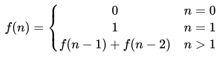

## 斐波那契数列

## 题目

定义一个函数,输入n,求斐波那契( Fibonacci)数列的第n项。

斐波那契数列的定义如下:

 

## 思路

对于斐波那契数列，从第三项开始，每一项都是前面两项的和。因此，可以用递归或者循环来实现，推荐循环的算法。

### 示例

代码在[这里](./Fibonacci.java)

单元测试在[这里](../../../test/java/question_9/FibonacciTest.java)
