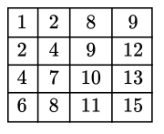

# 二维数组中的查找

## 题目
在一个二维数组中，每一行都按照从左到右递增的顺序排序，每一列都按照从上到下递增的顺序排序。请完成一个函数，输入这样一个二维数组和一个整数，判断数组中是否含有该整数。
## 思路

二维数组就类似下面的矩阵：

假如从上面的矩阵中查找**7**。如果从左上角开始遍历，每一行和每一列都需要遍历，遍历起来很麻烦。但是如果从右上角开始遍历，则可以逐步剔除一些行和列。

## 示例

代码在[这里](./SearchInMatrix.java)

单元测试在[这里](../../../test/java/question_3/SearchInMatrixTest.java)
