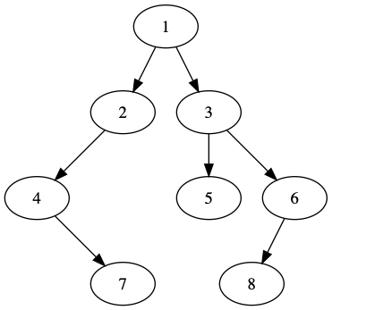

## 重建二叉树

## 题目

输入某二叉树的前序遍历和中序遍历的结果，请重建出该二叉树。

假设输入的前序遍历和中序遍历的结果中都不含重复的数字。

例如输入前序遍历序列`{1,2,4,7,3,5,6,8}`和中序遍历序列`{4,7,2,1,5,3,8,6}`，则重建出图2.6所示的二叉树并输出它的头结点。二叉树结点的定义如下:

## 思路

二叉树的遍历顺序，是以根元素的优先级定的。因此前序遍历中，第一个元素是根结点；而在中序中，根结点是在中间，左子树的节点位于根结点的左边，而右子树的节点位于根结点的右边。

所有，我们可以在前序遍历中知道跟节点，拿着根结点在中序遍历中知道左子树序列和右子树序列，进而获知前序数列中左子树和右子树的序列。递归遍历，进而知道整个树的结构。

### 示例

代码在[这里](./ConstructBinaryTree.java)

单元测试在[这里](../../../test/java/question_6/ConstructBinaryTreeTest.java)
