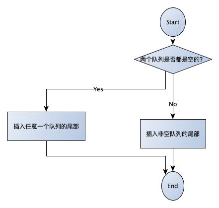
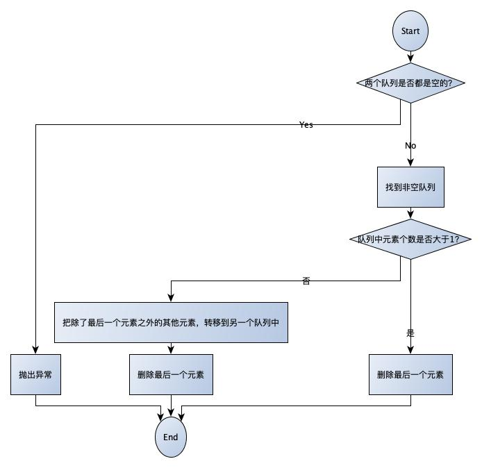

## 用两个队列实现栈

## 题目

用两个队列实现一个栈。栈的声明如下，请实现它的两个函数push和pop,分别完成在栈顶部插入结点和删除栈顶部结点的功能。

## 思路

由于栈是先进后出的，而队列是先进后出的。因此，我们借助两个队列实现栈的时候，把握下面两点：

1. 插入的时候

   

2. 弹出栈顶元素
  

  

  


### 示例

代码在[这里](./StackByQueue.java)

单元测试在[这里](../../../test/java/question_7_1/StackByQueueTest.java)

   ```

   

   ```
