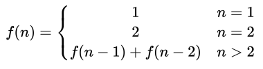

## 青蛙跳台阶

## 题目

一只青蛙一次可以跳上1级台阶,也可以跳上2级。求该青蛙跳上一个n级的台阶总共有多少种跳法。

## 思路

把`n`级台阶时的跳法看成是`n`的函数,记为`f(n)`。

当`n=1`时，有一种跳法。

当`n=2`时，有两种跳法：分别跳一级和一次性跳两级。

当`n>2`时,第一次跳的时候就有两种不同的选择:

1. 第一次只跳1级,此时跳法数目等于后面剩下的`n-1`级台阶的跳法数目,即为`f(n-1).`
2. 第一次跳2级,此时跳法数目等于后面剩下的`n-2`级台阶的.跳法数目,即为`f(n-2)`。

因此n级台阶的不同跳法的总数`fn)=f(n-1)+f(n-2)`. 方程式如下：

 

### 示例

代码在[这里](FrogJump.java)

单元测试在[这里](../../../test/java/question_9_1/FrogJumpTest.java)

